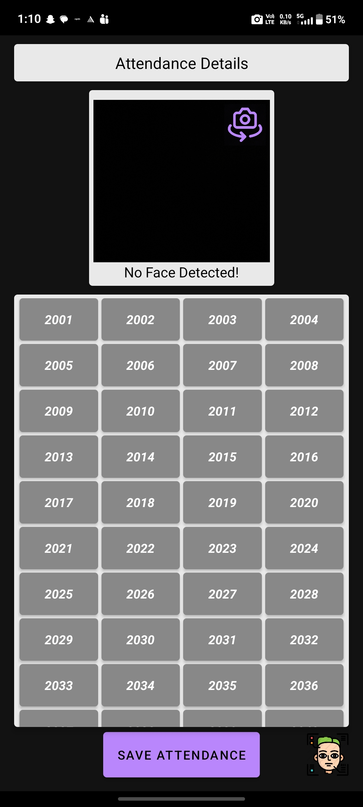

# Android Face Recognition Based Attendance System

## Project Overview
An Android application that automates attendance taking using face recognition. The app captures faces in real-time and matches them against registered user images to mark attendance accurately and efficiently.

## Features
- Real-time face detection and recognition
- Register users by capturing face images
- Mark attendance automatically upon successful recognition
- Generate attendance reports
- Simple and easy-to-use UI

## Screenshots

Image 1 — Login / Sign In screen  

Image 2 — Select Attendance Details screen (year/session/day/time/subject)  

Image 3 — Admin / Face Data, Practicals and Student Count screens  

Image 4 — Attendance Details with face detection grid & Save Attendance button  

## Tech Stack
- Java (Android)
- OpenCV (image processing)
- Firebase (optional backend for storage/authentication)
- Native components using CMake/C++ for performance-critical parts (where applicable)

## Prerequisites
- Android Studio
- Android device or emulator with camera
- Java JDK
- (If using Firebase) a Firebase project and google-services.json

## Installation
1. Clone the repository:
   git clone https://github.com/akshat-vhora/Android-Face-Recognition-Based-Attendace-System.git
2. Open the project in Android Studio.
3. Add any required SDKs and libraries noted in the app module's build.gradle.
4. If using Firebase, add your google-services.json to the app/ directory and configure Firebase in the project.
5. Build and run on a device or emulator.

## Usage
1. Register a new user by capturing their face image(s) within the app.
2. Use the attendance screen to scan faces—recognized users will be marked present.
3. Export or view attendance reports from the reports section.

## Credits
- Face recognition model template and implementation guidance: Real-Time_Face_Recognition_Android by atharvakale31 — https://github.com/atharvakale31/Real-Time_Face_Recognition_Android

This project uses the face recognition approach and parts of the workflow inspired by the above repository. Please refer to that repository for the original implementation details and licensing terms.

## Contributing
Contributions are welcome. Please open issues or submit pull requests with clear descriptions of changes.

## License
This repository is provided under the MIT License unless otherwise noted. If you include code from third-party sources, follow their license terms and provide attribution.

(End of file)
